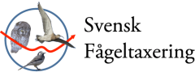

You have found the documentation for the `swedishbirdtrends` package, which distributes Swedish bird populations trend data for use with the R platform. The bundled data comes from http://www.fageltaxering.lu.se/resultat/trender at 2016-02-14.

## About the data source

"Svensk fågeltaxering" monitor the common birds of Sweden since 40 years. Birds are counted in summer and winter at hundreds of different sites. Since the counts are carried out in the same way each year, it is possible to detect which species that increase or decrease in numbers.



The project is carried out at the Department of Biology, Lund University, as a part of a national environmental monitoring project run by The Swedish Environmental Protection Agency and supported by all the 21 County Administrative Boards of Sweden.

The bird counts are mainly carried out by volunteers, and the project is the Swedish representative in the European network for bird monitoring (EBCC).


## Using bundled data

This example shows how to use the `birdtotals`and `birdtrends` data bundled in the package.

```{r, message=FALSE, warning=FALSE}
suppressPackageStartupMessages(library(swedishbirdtrends))
data(birdtotals)
data(birdtrends)

```

You can work with the data in different ways. We recommend using `dplyr` and `tidyr` - these packages offers better flexibility than many alternatives, such as SQL, especially when it comes to pivoting and using any kind of function you can think of for cleaning data, such as georeferencing etc.

```{r, message=FALSE, warning=FALSE}
library(dplyr)

# filter columns on one or multiple values
birds <- 
  birdtotals %>% 
  filter(Series == "Standard") %>%
  filter(Significance %in% c("*", "**", "***")) 

# renaming columns
trends <-
  birdtrends %>%
  select(Art = Arthela, Year, Index = Measure, Rutt = Series)

```

Here are the first few rows of the extract from `birdtotals` displayed as a static table:

```{r, echo=FALSE, results='asis'}
knitr::kable(birds %>% head(5))
```

Here are the first few rows of the extract from `birdtrends` displayed as a static table:

```{r, echo=FALSE, results='asis'}
knitr::kable(trends %>% head(5))
```

## Data wrangling

You can make more advanced extracts. Here we extract some birds that are winners / gainers and some that are losers / on the decline ;) and display these "top ten" lists in tabular formats.

```{r}
# find the top 20 "winners" and "losers"
winners <- 
  birds %>%
  filter(YPctChg > 0) %>%
  arrange(desc(YPctChg)) %>%
  select(Art = Arthela, YPctChg, Ind, Significance) %>%
  head(10)

losers <- 
  birds %>%
  filter(YPctChg <= 0) %>%
  arrange(-desc(YPctChg)) %>%
  select(Art = Arthela, YPctChg, Ind, Significance) %>%
  head(10)

```

Here are the first few rows of the rising birds displayed as a table:

```{r, echo=FALSE, results='asis'}
knitr::kable(winners %>% head(5))
```

Here are the first few rows of the declining birds displayed as a table:

```{r, echo=FALSE, results='asis'}
knitr::kable(losers %>% head(5))
```


## Creating plots and figures

Packages such as `ggplot2` - which can be styled using themes in `ggthemes` - can be used to create figures such as horizontal bar graphs or line graphs etc that can be displayed side-by-side. 

```{r, fig.show='hold', `fig.cap = "Swedish bird population trends"`}

library(ggplot2)
library(ggthemes)

plot_w <- 
  ggplot(winners) +
  aes(x = reorder(Art, YPctChg), y = YPctChg) +
  geom_bar(stat = "identity") +
  labs(x = "") + labs(y = "% förändr per år") +
  theme_economist_white() +
  coord_flip()

plot_l <- 
  ggplot(losers) +
  aes(x = reorder(Art, YPctChg), y = YPctChg) +
  geom_bar(stat = "identity") +
  labs(x = "") + labs(y = "% förändr per år") +
  theme_wsj() +
  coord_flip()

```

## Plotting with style

Here the plots created above are displayed, using two different styles (from The Economist and Wall Street Journal respectively from left to right):

```{r, fig.show='hold', warning=FALSE}
plot_w
plot_l
```

## Static trend plot

This is a static trend plot for "Storskarv":

```{r, fig.show='hold', warning=FALSE}

storskarv <- 
  birdtrends %>% 
  filter(Series == "Vinter") %>% 
  filter(Arthela == "Storskarv") %>% 
  select(Year, Measure, Series)

koltrast <- 
  birdtrends %>% 
  filter(Series == "Vinter") %>% 
  filter(Arthela == "Koltrast") %>% 
  select(Year, Measure, Series)

plot_trend <- function(df, title) {
  ggplot(df) + 
    aes(x = Year, y = Measure, group = Series) + 
    scale_x_discrete(breaks = c(1975, 1985, 1998, 2005, 2015)) +
    ylab("Index") + ggtitle(title) +
    geom_line(size = 1.5) +
    theme_solarized()
  
}

plot_trend(storskarv, "Storskarv")
plot_trend(koltrast, "Koltrast")

```

## Plotting interactively

It is possible to provide interactive web applications as part of the package using `shiny`. To see a couple of examples of this using the datasets bundled in this package, use the following approach:

```{r, fig.width=7,  eval=FALSE}
runShinyApp("birdtrends")
runShinyApp("birdtotals")
```

## Finally


> "Better Ten Birds singing in the Forest than One Jaild Bird"
([via](http://www.wisegeek.org/what-does-a-bird-in-the-hand-is-better-than-two-in-the-bush-mean.htm))


